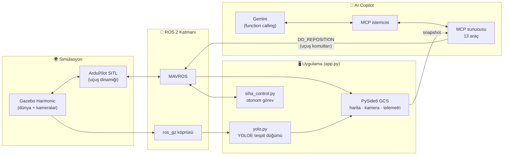

<div align="center">

# 🛩️ CUAV Digital Twins

### Konuşarak uçurduğunuz SİHA — dijital ikiz, yapay zekâ destekli yer kontrol istasyonu

*"Sağa dön." — "100 metre ileri git." — "Başlangıç noktasına dön."*
**Hepsi gerçek uçuş komutu. Hepsi sohbet penceresinden.**


</div>

---

## 🎯 Bu proje ne yapıyor?

V-kuyruklu sabit kanatlı bir SİHA'nın **dijital ikizini** kurar ve tek komutla uçurur:
uçak Gazebo'da pistten kendi kendine kalkar, 15 m irtifada 900 m'lik rotayı düz uçar,
alt kamerasıyla yerdeki hedefleri **gerçek bir YOLOE modeliyle** tespit eder, kutuların
üzerindeki **QR kodları havadan okur**, kargo kutularını **renginden ayırt eder** — ve
tüm bunlar olurken siz yer kontrol istasyonundaki AI Copilot'la konuşarak uçağa
müdahale edebilirsiniz.

Sıradan bir demo değil: buradaki her eşik, her prompt, her cisim **ölçülerek** seçildi.
Neyin çalışmadığı da (ve neden çalışmadığı da) kodun içinde belgeli.

## ✨ Öne çıkanlar

| | Özellik | Detay |
|---|---|---|
| 🗣️ | **Sohbetle uçuş kontrolü** | "sola dön", "irtifayı 30 m'ye çıkar", "rotaya devam et" → Gemini, MCP araçlarıyla `MAV_CMD_DO_REPOSITION` gönderir. Otonom kontrolcü operatörü **ezmez**: manuel komutta rota izleme askıya alınır, "devam et" ile kaldığı yerden sürer. |
| 🔌 | **Gerçek MCP mimarisi** | AI araçları (13 adet) uygulamaya gömülü değil — bağımsız bir **Model Context Protocol** sunucusunda yaşar (stdio üzerinde JSON-RPC 2.0, sıfır ek bağımlılık). Araçlar çalışma anında keşfedilir; yarın Gemini yerine başka bir LLM taksanız kod değişmez. |
| 👁️ | **Ölçüm güdümlü tespit** | YOLOE açık-sözlük modeli; prompt listesi rotayla birebir eşleşir. Katmanlı sahte-pozitif savunması: fiziksel boyut kapısı (irtifa+FOV'dan metre hesabı), kendi-gölge bastırma, iç içe kutu filtresi, sınıf bazlı güven tabanları. |
| 📦 | **QR + renk zekâsı** | 15 m irtifadan kutu üzerindeki QR metni çözülür (4× büyütme hilesiyle); kırmızı/mavi kargo kutuları tespit sonrası HSV analiziyle ayırt edilir — çünkü ölçüm gösterdi ki nadir bakışta modeli ateşleyen şey renk değil, **desen kontrastı**. |
| 🗺️ | **Canlı taktik GCS** | PySide6 arayüz: QPainter taktik harita, kutulanmış kamera akışı, telemetri/pusula, tespit tablosu, zaman çizelgesi ve uçuş sonunda tek tuşla taktik rapor. |
| 💻 | **Mütevazı donanımda çalışır** | 8 GB RAM + GTX 1650 hedeflendi: FPS/çözünürlük sınırlama, GPU/CPU iş bölümü, zram takası — OOM çökmesine karşı savunma dahil. |

## 🏗️ Mimari



**Veri akışı bir cümlede:** Gazebo kamerayı ROS'a köprüler → YOLOE tespit edip kutulanmış
görüntü + JSON yayınlar → GCS bunları tabloya/haritaya işler → operatör sohbet yazınca GUI
anlık durumu MCP sunucusuna iter → Gemini araç çağırır → araç ya veriyi raporlar ya da
MAVROS üzerinden uçağı **gerçekten** yönlendirir.

## 💬 Sohbetten uçuş komutları

| Operatör yazar | Arkada olan |
|---|---|
| `sağa dön` | `turn_heading(90)` → uçak 90° sağa kırar, yeni yönde düz devam eder |
| `100 metre ileri git` | `fly_forward(100)` → hedefe uçar, üzerinde daire çizerek bekler |
| `irtifayı 30 metreye çıkar` | `change_altitude(30)` → düz uçarken tırmanır (10–120 m güvenlik aralığı) |
| `başlangıç noktasına dön` | `return_to_start` → kalkış noktasına döner, üzerinde bekler |
| `rotaya devam et` | `resume_route` → askıdaki otonom görev kaldığı yerden sürer |
| `şu ana kadar neler tespit ettin?` | `get_detection_history` → tür, güven, koordinat, QR metinleriyle döküm |

> Güvenlik: irtifa ve mesafe komutları sınırlara sıkıştırılır; model araç çağırmadan
> "komut gönderdim" diyemez; veri araçları boş dönerse uydurmak yerine bunu söyler.

## 🔬 "Ölçmeden karar yok" felsefesi

Bu depodaki ilginç kararların hepsi deneyle alındı ve gerekçeleri kod yorumlarında yaşıyor:

- **Düz renkli kutu havadan görünmez** (güven 0.05) — QR desenli alçak kutu 0.60+.
  Bu yüzden rotadaki her hedef yüksek kontrastlı düzlemsel desen taşır.
- **Renkli kutular** bile QR desenini korur; renk ayrımı YOLO'ya değil,
  tespit sonrası HSV baskın-renk analizine emanet (s/b kutuda %0, renklide %55 → geniş marj).
- **SİHA kendi gölgesini tespit ediyordu** — çözüm: uçak yol alırken karede sabit kalan
  bölgeleri öğrenip bastıran `EgoStaticZones` (gerçek cisim karede sabit kalamaz).
- **Tepeden otomobil tanınmıyor** (yan yatırma, ölçek büyütme, prompt denemeleri dahil
  hepsi ölçüldü, hiçbiri çalışmadı) — bilinen çözüm yolu nadir görüntülerle fine-tune
  (`eval/train_yolo.py` hazır bekliyor).

## 🚀 Çalıştırma

**Önkoşullar:** Ubuntu + ROS 2 (MAVROS ile) + Gazebo Harmonic (gz-sim 8) + ArduPilot
kaynak ağacı (`~/ardupilot`, SITL derlenmiş) + Python paketleri (`PySide6`, `ultralytics`,
`opencv-python`, `pydantic`).

```bash
# 1) Gemini API anahtarı (AI Copilot için)
echo "GEMINI_API_KEY=..." > config/.env

# 2) Model ağırlıkları proje köküne (ultralytics ilk kullanımda indirir
#    veya elle yerleştirin): yoloe-26s-seg.pt + mobileclip2_b.ts

# 3) Tek komut — Gazebo, SITL, MAVROS, köprü, tespit ve GCS hep birlikte:
python3 app.py
```

Uçuş butonuna bastıktan sonra: otomatik kalkış → 900 m otonom rota → hedef tespitleri
tabloda/haritada → istediğiniz an sohbetten müdahale. Tüm süreç logları `logs/build_*/`
altına ayrışır.

## 📁 Proje yapısı

```
├── app.py               # Giriş noktası: tüm alt süreçler + GCS arayüzü
├── mcp_server.py        # MCP araç sunucusu (8 veri + 5 uçuş aracı)
├── siha_control.py      # Otonom görev: kalkış → düz rota → LOITER (+ operatör devralma)
├── yolo.py              # YOLOE tespit düğümü: filtre kapıları, QR çözme, renk analizi
├── threads/             # Qt thread'leri: kamera, telemetri, tespit, Gemini, MCP istemcisi
├── interface/           # GUI bileşenleri: taktik harita, pusula, HUD, zaman çizelgesi
├── worlds/              # Gazebo dünyası: pist + ölçümle seçilmiş rota cisimleri
├── models/              # SİHA modeli + doku üreteçleri (QR, stop, dama, renkli kutu)
├── eval/                # Değerlendirme + veriseti üretimi + fine-tune altyapısı
└── config/              # SITL parametreleri + .env (API anahtarı, git dışı)
```

---

<div align="center">

*Bir staj projesinin "keşke gerçek dünyada da her karar böyle ölçülerek alınsa" hâli.*

</div>
