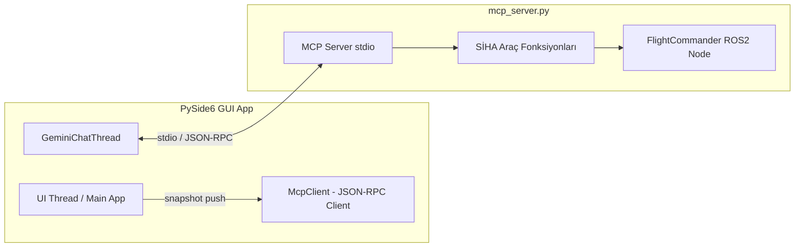
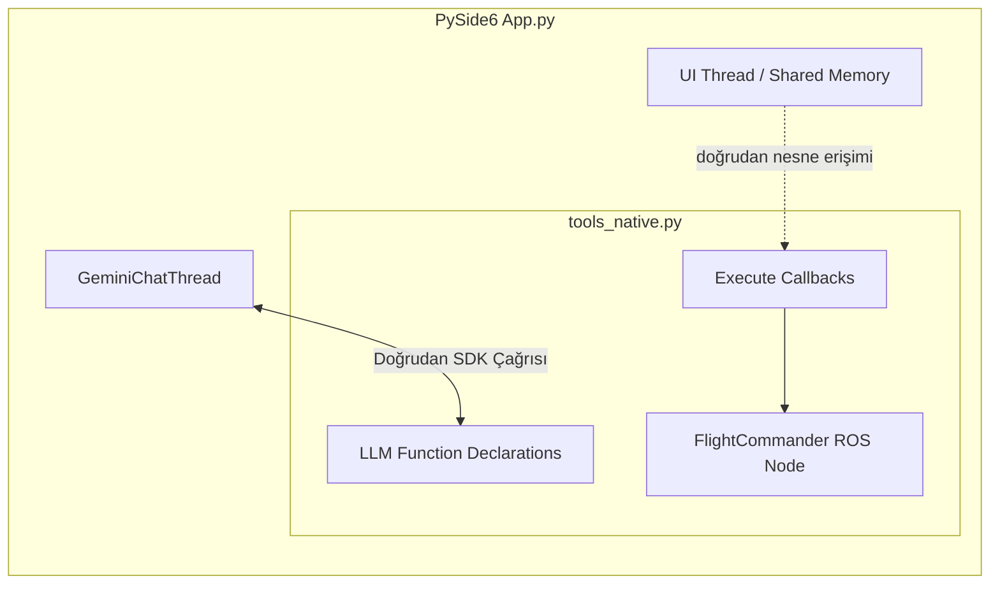

# Sunum: SİHA GCS Sisteminin MCP Yerine Native Tool (Fonksiyon Çağrısı) Mimarisi ile Yeniden Yapılandırılması

---

## 📋 Sunum İçeriği

1. **Giriş ve Sunum Amacı**
2. **MCP (Model Context Protocol) vs. Native Tool Kavramsal Yaklaşımı**
3. **Sistem Native Tool Olsaydı Mimari Nasıl Olurdu?**
4. **Adım Adım Nasıl Oluşturulurdu? (Kod Yapısı ve Şablonlar)**
5. **Detaylı Karşılaştırma Matrisi (Avantajlar / Dezavantajlar)**
6. **Sonuç ve Mimari Tercih Önerileri**

---

# Slayt 1: Giriş ve Sunum Amacı

## 🎯 Çalışmanın Amacı
* Mevcut SİHA GCS sisteminde araçlar (**telemetri, YOLO tespitleri, VLM sahne analizi, flight commander uçuş komutları**) **MCP (Model Context Protocol)** standardı ve `stdio` üzerinden ayrılmış bir alt süreç (`mcp_server.py`) olarak çalışmaktadır.
* Bu sunumda; **"Bu sistem MCP yerine doğrudan LLM'in Native Tool / Function Calling (Yerel Araç) mekanizması ile yapılandırılsaydı mimari nasıl olurdu, nasıl yazılırdı ve farkları neler olurdu?"** sorusu yanıtlanmaktadır.

```
┌─────────────────────────────────────────────────────────────────────────┐
│                           TEMEL SORU                                    │
│  MCP (Bağımsız Süreç + JSON-RPC) ──VS── Native Tool (Gömülü Python SDK)│
└─────────────────────────────────────────────────────────────────────────┘
```

---

# Slayt 2: Mimari Dönüşüm Şeması

## MCP Mimarisi (Mevcut Durum)


## Native Tool Mimarisi (Alternatif Senaryo)


---

# Slayt 3: Native Tool Mantığı Nasıl Çalışır?

## 💡 Temel Felsefe
Native Tool yaklaşımında, araçlar harici bir ağ/stdio sunucusu değil, **Doğrudan LLM SDK'sına (Google GenAI / OpenAI) kayıtlı Python fonksiyonlarıdır**.

1. **Tanımlama:** Araçlar Python `@tool` decorator'ları veya `types.FunctionDeclaration` nesneleri ile uygulamanın içinde tanımlanır.
2. **Kayıt:** LLM İstemcisine (`genai.Client` / `openai.OpenAI`) model başlatılırken `tools=[get_telemetry, turn_heading, ...]` şeklinde verilir.
3. **Çağrı (Invocation):** LLM bir fonksiyon çağırmak istediğinde, SDK bunu uygulama içerisindeki yerel fonksiyonu bizzat bularak çalıştırır (veya `function_call` payload'u olarak döner ve uygulama doğrudan çalıştırır).

---

# Slayt 4: Nasıl Oluşturulurdu? - Adım 1: Araç Modülünün Tasarlanması

`tools_native.py` adında tek bir gömülü modül oluşturulurdu:

```python
# tools_native.py - Native Tool Yapısı
import math
import rclpy
from mavros_msgs.srv import CommandInt, CommandLong, SetMode

class NativeSihaTools:
    """SİHA GCS için Gömülü (Native) Tool Katmanı.
    Harici MCP süreci ve IPC katmanı yoktur; bellek ve ROS ile doğrudan konuşur.
    """
    def __init__(self, shared_state):
        self.state = shared_state  # App memory pointer (snapshot serileştirmeye gerek yok!)
        self._commander = None

    # ---- TOOL 1: Telemetri ----
    def get_telemetry(self) -> dict:
        """SİHA'nın anlık telemetrisini döndürür: irtifa, hız, otopilot modu, koordinat vb."""
        tel = self.state.get("telemetry", {})
        return {
            "altitude_m": round(tel.get("alt", 0.0), 2),
            "speed_ms": round(tel.get("speed", 0.0), 2),
            "mode": tel.get("mode", "?"),
            "lat": round(tel.get("lat", 0.0), 6),
            "lon": round(tel.get("lon", 0.0), 6),
            "heading_deg": tel.get("heading", 0),
            "battery_percent": int(tel.get("battery", 0)),
        }

    # ---- TOOL 2: Uçuş Komutu (Heading) ----
    def turn_heading(self, degrees: float) -> dict:
        """Uçağın burnunu verilen derece kadar döndürür (-180..180)."""
        degrees = ((float(degrees) + 180.0) % 360.0) - 180.0
        tel = self.state.get("telemetry", {})
        lat, lon, heading, alt = tel.get("lat"), tel.get("lon"), tel.get("heading", 0), tel.get("alt", 0)
        
        new_heading = (heading + degrees) % 360.0
        # ROS MAVROS komutunu doğrudan aynı süreçte çağır
        self.get_commander().goto_heading(lat, lon, new_heading, alt)
        
        return {
            "status": f"Komut gönderildi: {abs(degrees):.0f}° {'sağa' if degrees > 0 else 'sola'} dönüş.",
            "new_heading_deg": round(new_heading, 1)
        }

    def get_commander(self):
        if not self._commander:
            self._commander = FlightCommanderNode()
        return self._commander
```

---

# Slayt 5: Nasıl Oluşturulurdu? - Adım 2: LLM Entegrasyonu (Gemini SDK)

`threads/gemini_t.py` içinde Gemini istemcisine araçların bildirilmesi:

```python
# Native Tool Entegrasyonu (threads/gemini_t.py)
from google import genai
from google.genai import types
from tools_native import NativeSihaTools

class GeminiNativeChatThread(QThread):
    def __init__(self, shared_state, parent=None):
        super().__init__(parent)
        self.shared_state = shared_state
        self.native_tools = NativeSihaTools(shared_state)
        
        # 1. SDK İstemcisi ve Araçların Doğrudan Tanımlanması
        self.client = genai.Client(api_key=API_KEY)
        self.tool_functions = [
            self.native_tools.get_telemetry,
            self.native_tools.turn_heading,
            self.native_tools.fly_forward,
            self.native_tools.change_altitude,
            self.native_tools.get_detections,
            self.native_tools.generate_tactical_report
        ]

    def run_prompt(self, user_text: str):
        # 2. Otomatik Fonksiyon Çağrısı ile Model Yanıtı Alma (Automatic Function Calling)
        response = self.client.models.generate_content(
            model='gemini-2.5-flash',
            contents=user_text,
            config=types.GenerateContentConfig(
                tools=self.tool_functions,  # Fonksiyon pointer'ları doğrudan verilir
                temperature=0.2,
            )
        )
        return response.text
```

---

# Slayt 6: Kod ve Karmaşıklık Karşılaştırması

```
┌────────────────────────────────────────────────────────────────────────────┐
│                    KOD SATIRI VE BİLEŞEN SAYISI                            │
├───────────────────────────────┬────────────────────────────────────────────┤
│ MCP Mimarisi                  │ Native Tool Mimarisi                       │
├───────────────────────────────┼────────────────────────────────────────────┤
│ 📄 mcp_server.py (787 satır)  │ 📄 tools_native.py (~250 satır)            │
│ 📄 mcp_client.py (160 satır)  │ 📄 threads/gemini_t.py (~150 satır)        │
│ 📄 JSON-RPC 2.0 Şemaları      │ 📄 Otomatik Python Docstring Type Hinting   │
│ 📄 stdio IPC / Buffer Yönetimi │ ❌ IPC yok, stdio dinleme yok               │
│ 📄 snapshot_push bildirimleri │ ❌ Snapshot serileştirme/kopyalama yok     │
│ Toplam: ~1100 Satır Kod       │ Toplam: ~400 Satır Kod (%60 daha az)       │
└───────────────────────────────┴────────────────────────────────────────────┘
```

---

# Slayt 7: Detaylı Karşılaştırma Matrisi

| Kriter | MCP (Model Context Protocol) | Native Tool (Gömülü Fonksiyon) |
| :--- | :--- | :--- |
| **Süreç Mimarisi** | Ayrı Süreç (Subprocess / IPC) | Tek Süreç (Monolitik / Gömülü) |
| **Gecikme (Latency)** | ms seviyesinde (JSON serileştirme + stdio) | µs/ns seviyesinde (Bellek içi çağrı) |
| **Bellek Erişimi** | Dolaylı (`notifications/snapshot` push) | Doğrudan (GUI / App shared state pointer) |
| **LLM Bağımsızlığı** | **%100 Bağımsız** (Claude, Gemini, OpenAI, Ollama) | **Model/SDK Bağımlı** (Gemini veya OpenAI SDK formatı) |
| **Hata İzolasyonu** | **Yüksek** (Server çökse GUI etkilenmez) | **Düşük** (Tool çökerse tüm App/GUI çökebilir) |
| **Eklenebilirlik** | Sunucuya araç ekle, istemci otomatik keşfeder | Python koduna fonksiyon ekle, SDK listesini güncelle |
| **Güvenlik / Yetkilendirme**| İstemci sunucuya izin verir / kısıtlar | Uygulama içi tüm haklara sahiptir |

---

# Slayt 8: Avantajlar ve Dezavantajlar (Neden Native Tool?)

## 🟢 Native Tool Avantajları
1. **Daha Az Kod ve Sadelik:** stdio IPC, JSON-RPC 2.0 el sıkışmaları, buffer parçalanmaları ve zaman aşımları ile uğraşılmaz.
2. **Sıfır IPC Gecikmesi:** Süreçler arası JSON dönüşümü ve `notifications/snapshot` verisini sürekli ağdan/stdio'dan gönderme yükü kalkar.
3. **Doğrudan Bellek ve UI Erişimi:** GUI thread'inin verilerine pointer üzerinden anında erişilir. Rapor penceresi açma gibi UI işlemleri için `ui_action` event paketlemeye gerek kalmaz.

## 🔴 Native Tool Dezavantajları
1. **Sağlam LLM Bağımlılığı:** Gemini SDK'sından OpenAI SDK'sına geçildiğinde şema tanımları ve fonksiyon bağlama mantığı yeniden yazılmalıdır.
2. **Süreç İzolasyonunun Olmaması:** ROS2/MAVROS kütüphanesinde yaşanacak segfault veya ağır bir Python hatası tüm SİHA GCS arayüzünü (PySide6) düşürebilir.
3. **Modülerlik Kaybı:** Araçlar başka bir istemci tarafından (örneğin CLI, Claude Desktop veya ayrı bir mobil arayüz) **tekrar kullanılamaz**.

---

# Slayt 9: Karar Rehberi: Hangi Durumda Hangisi Seçilmeli?

```
                     ┌──────────────────────────────┐
                     │ Hangi Mimarayı Seçmelisiniz? │
                     └──────────────┬───────────────┘
                                    │
           ┌────────────────────────┴────────────────────────┐
           ▼                                                 ▼
┌─────────────────────────────┐                   ┌─────────────────────────────┐
│    Native Tool Seçilmeli    │                   │        MCP Seçilmeli        │
├─────────────────────────────┤                   ├─────────────────────────────┤
│ • Tek bir LLM sağlayıcısı   │                   │ • Çoklu LLM / Copilot       │
│   (örn. sadece Gemini)      │                   │   desteği (Gemini, Claude)  │
│ • Proje boyutu küçük/orta   │                   │ • Servis tabanlı mikroservis│
│ • Minimum gecikme kritik    │                   │   mimariye geçiş            │
│ • Kod karmaşıklığını        │                   │ • Modüllerin ve ROS         │
│   düşük tutmak ana hedef    │                   │   bağlantılarının izolasyonu│
└─────────────────────────────┘                   └─────────────────────────────┘
```

---

# Slayt 10: Özet ve Sonuç

* **SİHA GCS Projesinde Native Tool Kullanılsaydı:**
  * `mcp_server.py` ve `mcp_client.py` tamamen silinirdi.
  * Araçlar doğrudan `tools_native.py` içinde standart Python fonksiyonları olarak yazılıp Gemini SDK `tools` parametresine verilirdi.
  * Geliştirme süreci daha hızlı ve kod tabanı %60 daha kısa olurdu.

* **Neden MCP Tercih Edildi / Edilmeli?**
  * SİHA uçuş kontrol araçlarının ROS2 bağlamı, otonom rota takibi ve potansiyel segfault riskleri **process isolation (süreç izolasyonu)** gerektirir.
  * Gelecekte AI Copilot modelinin Claude, local Llama veya başka bir agentic framework ile değiştirilmesi istendiğinde **araç katmanına tek satır kod dokunulmadan** uyum sağlanması amaçlanmıştır.
